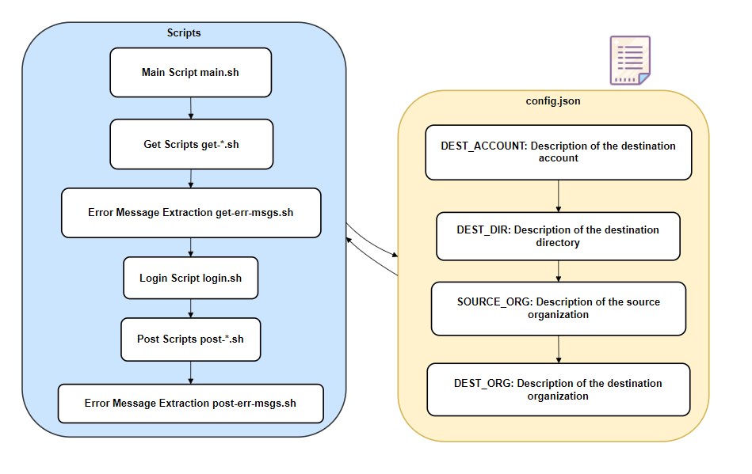

# Project Name

Apigee migration implementation

## Structure outline

## Prerequisites

- [jq](https://stedolan.github.io/jq/) must be installed.

## Usage

1. Clone the repository.
2. Add your configuration details to `config.json`.
3. Execute `main.sh` to perform the following files:
4. Inspect error messages using `*-err-msgs.sh`.

- if there is error after all the get actions, it stops and print error in `get-err-msgs.json`
- if there is error after all the post actions, it stops and print error in `post-err-msgs.json`

5. For debugging, you should get all the files listed in the `file_names.json`, check if you have missing files in the `DEST_DIR` and open up the returned files for debugging purposes.

## Configuration

Explain the configuration options in `config.json`:

- `SOURCE_ORG`: Description of the source organization.
- `DEST_ORG`: Description of the destination organization.
- `DEST_ACCOUNT`: Description of the destination account.
- `DEST_DIR`: Description of the destination directory.

## Scripts

### Main Script (`main.sh`)

- Purpose: To run the Additional Scripts below

### Get Scripts (`get-*.sh`) : These scripts retrieve Apigee information from the source project.

### Login Script (`login.sh`) : Handles authentication and retrieves necessary credentials.

### Post Scripts (`post-*.sh`) : These scripts perform actions based on the retrieved data from the source project.

### Error Message Extraction (`*-err-msgs.sh`) : generates error messages for inspection.
