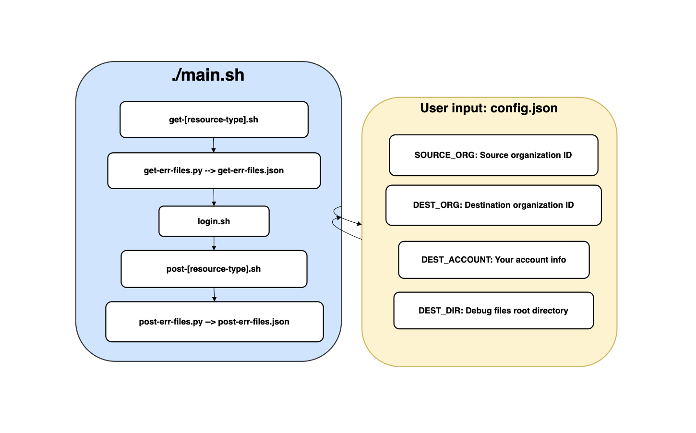

# Apigee migration implementation

## **Overview**

This repository provides a robust solution for seamlessly migrating configurations and data between two Apigee environments. It is tailored for organizations looking to transfer existing Apigee setups from one project to another. It involves fetching (GET) various resources from a source organization then creating (POST) them in a destination organization.

- We migrate the settings of the below items in Apigee in sequence `(sharedflow-->Flow hooks-->Key Value Map-->target Server-->API proxies-->API products-->Developers-->Apps)`

### **Scripts Detail**



- Main Script (`./main.sh`)
- Get Scripts (`get-[resource-type].sh`) : These scripts retrieve Apigee information from the source project.
- Login Script (`login.sh`) : Handles authentication and retrieves necessary credentials.
- Post Scripts (`post-[resource-type].sh`) : These scripts perform actions based on the retrieved data from the source project.
- Error Message Extraction (`get-err-files.py`) (`post-err-files.py`) : generates error messages for inspection.

The [resource-type] placeholder in script names represents the specific Apigee component being handled, such as sharedflows, targetservers, or apiproducts. Each script is specialized to manage the migration of its respective resource type, ensuring a focused and orderly transition process.

# **How to use**

## Setup Requirements and Tools

1. Installed tools: `jq`, `curl`, `git`.
2. You need to have the Google Cloud Command Line Interface (CLI) installed and set up on your machine and Access to two Apigee organizations (source and destination).

- After installing the CLI, run the command: `gcloud init` and follow the on-screen instructions to authenticate your account and select your default project.
- Login by running the command `gcloud auth login` and follow the prompts to log in.
- Set Up by running `gcloud config set project [YOUR_PROJECT_ID]`.

3. Warning: Before using this repository, please ensure that your Apigee environment is properly set up and created manually. Failure to set up your environment correctly may result in unexpected behaviors or errors during the execution of scripts.

## **Migration Steps**

1.  **Clone the Repository**:
    Begin by cloning this repository to your local system using:

    ```bash
    git clone https://github.com/CloudMile-Inc/2023-tw-dev-Apigee-migration.git
    ```

2.  **Configure**:
    Next, configure the **`config.json`** file in the root folder and fill in your configuration:

    - **`SOURCE_ORG`**: ID of the source Apigee organization. Example: **`"tw-rd-de-bill-404606"`**
    - **`DEST_ORG`**: ID of the destination Apigee organization. Example: **`"superchatbill"`**
    - **`DEST_ACCOUNT`**: Email of the owner of the destination organization. Example: **`"bill.liao@mile.cloud"`**
    - **`DEST_DIR`**: Directory for storing debug files. Example: **`"results"`** (A default folder named `results` will be created in the root folder to store debug files)

3.  **Running Migration Scripts**:
    Execute **`main.sh`** to perform the migration actions:
    ```bash
    ./main.sh
    ```
4.  **Debugging and Troubleshooting**:
    If you encounter any errors during the GET actions, the system will display the following message: `Errors found in GET actions. Aborting...`. In this case, the subsequent POST actions will not be executed. To address this:

    - **Check the `results` Folder:** Navigate to the `results` folder to review error logs or output files. This will help you identify the source of the error.
    - **Follow Debugging Instructions:** Refer to the detailed debugging steps provided in the subsequent section titled 'Step-by-Step Debugging Guide'. This section will guide you through the necessary steps to identify and resolve issues.
    - **Rerun Migration Script:** After resolving the errors, execute `main.sh` again to restart the migration process.

# **Step-by-Step Debugging Guide:**

### **How to Debug:**

1. **Inspect Error Files**: Check **`get-err-files.json`** for GET errors and **`post-err-files.json`** for POST errors.
2. **Error Details**: These files contain:
   - **`path`**: Location of the detailed error log.
   - **`status_code`**: HTTP code indicating the type of error.
   - **`message`**: Brief error description.
3. **Locate Error Logs**: Go to the specified path to understand the issue. For example:

   ```json
   {
     "error_details": [
       {
         "path": "results/post-err/developer/developer_bill.liao@mile.cloud_dst_error.json",
         "status_code": 409,
         "message": "Developer named bill.liao@mile.cloud already exists in organization {1}"
       }
     ]
   }
   ```

## **Repository Folder Structure and Naming Conventions**

### **Folder Structure:**

- File names include all relevant identifiers and are organized hierarchically. For instance, the file **`sharedflow_sha25_revision_1_deployment_dst.json`** would be located in the directory **`DEST_DIR/post/sharedflow/deployment/`**.

Here's a quick overview of the project folder structure:

```
├──./main.sh - Main execution script.
├── get/ - Scripts to fetch data from the source Apigee project.
│   ├── get-[resource-type].sh
├── post/ - Scripts to create resources in the destination Apigee project.
│   ├── post-[resource-type].sh
├── login.sh - Handles authentication and credential retrieval.
└── results/ - Result scripts for curl response.
    ├── get/
    ├── post/
    ├── get-err/
    └── post-err/
├── get-err-files.py - Scans files in get-err directory
├── post-err-files.py - Scans files in post-err directory
└── config.json - User manually input project configuration
```

- **GET Successful File:**
  - Example of a successful GET file: **`api-products_src.json`**
  - Located in: **`DEST_DIR/get/products/`**
- **GET Error File:**
  - Example of an error file for a failed GET action: **`api-products_src_error.json`**
  - Located in: **`DEST_DIR/get-err/products/`**
- **POST Successful File:**
  - Example of a successful POST file: **`api-products_dst.json`**
  - Located in: **`DEST_DIR/post/products/`**
- **POST Error File:**
  - Example of an error file for a failed POST action: **`api-products_dst_error.json`**
  - Located in: **`DEST_DIR/post-err/products/`**

### **Naming Conventions:**

- Files are systematically named to clearly indicate their purpose and content based on the action and result.
- For the **`[resource-type]`** part, a naming prefix is added using the resource type. For instance, a file like **`sharedflow_sha25_revision_1_deployment_dst.json`** is constructed as **`sharedflow_${name}_revision_${revision_number}_deployment_dst.json`**.

Below is an overview showcasing the structure and file naming rules in the `results/get` folder for the API response files:

```
├── results/
│   ├── api/
│   │   ├── kvm/
│   │   │   └── api_${api_name}_kvm_src.json
│   │   ├── deployment/
│   │   │   └── api_${api_name}_deployment_src.json
│   │   ├── apis-revision_src.json
│   │   ├── apis-src.json
│   │   └── api_${api_name}_revision_${revision_number}_src.zip
│   ├── developer/
│   │   ├── developers.src.json
│   │   └── developer_${developer_name}@${domain}_src.json
│   ├── environment/
│   │   ├── flowhook/
│   │   │   ├── environment_${env_name}_flowhook_src.json
│   │   │   └── environment_${env_name}_flowhook_${hook_type}_src.json
│   │   ├── kvm/
│   │   │   └── environment_${env_name}_kvms_src.json
│   │   ├── targetserver/
│   │   │   ├── environment_${env_name}_targetservers_src.json
│   │   │   └── environment_${env_name}_targetserver_${server_name}_src.json
│   │   └── environment_${env_name}_src.json
│   ├── keyvaluemaps/
│   │   └── keyvaluemaps_src.json
│   └── product/
│   │   ├── api-products_src.json
│       └── product_${product_name}_src.json
│   ├── sharedflow/
│   │   ├── deployment/
│   │   │   └── sharedflow_${name}_deployments_src.json
│   │   ├── revision/
│   │   │   ├── sharedflow_${name}_src.json
│   │   │   └── sharedflow_${name}_revision_${revision_number}_src.zip
│   │   └── sharedflow_${name}_deployments_src.json
```
